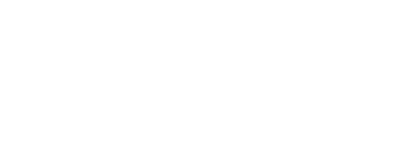

# Primeiro Semestre - Fatech
#### Equipe em 2°S 2021

## Parceiro Acadêmico

A Faculdade de Tecnologia de São José dos Campos — Prof. Jessen Vidal que pertence ao Centro Paula Souza, oferece cursos de graduação para formar tecnólogos. Para acompanhar a onda da indústria 4.0, a escola decidiu adotar uma estratégia de ensino diferente chamada Aprendizado por Projeto Integrador (API). 

E nesse 1º semestre o projeto integrador desenvolvido  com um cliente interno, sendo um dos professores.

## Visão do Projeto 

O objetivo era fazer um site que permitisse visualizar e pesquisar de forma simples os outros projetos desenvolvidos na instituição, desse da implementação do projeto integrador. Mas o link do GitHub das equipes estava somente disponível no YouTube, o nosso cliente não possuía controle sobre eles e muitos estavam sendo perdidos com o passar do tempo. 

Na época cada equipe fazia um vídeo explicando qual foi a solução para atender o problema proposto, e o link do GitHub do projeto era colocado na descrição do vídeo. A solução seria fazer a raspagens de todos os links do GitHub que estava na descrição do vídeo do YouTube e depois fazer a clonagem dos repositórios dos projetos anteriores da Fatec de forma automatizada .

## Demonstração do projeto
##### Para assistir os gif, clique no título abaixo que se interessar.

<b>Raspagem de dados </b>

   
    <tr>
     
    </tr>

<b>Clonagem dos Gits</b>

   
    <tr>
     
    </tr>

## Link para Acessar o Projeto

## Tecnologias Utilizadas

|Tecnologia	|Uso no Projeto|
| :---: | :--- | 
|| Python:  Utilizada para a criação do código, na parte de clonagem e raspagem. |
||JavaScript: Foi utilizada para desenvolver o site.|
||HTML: Linguagem utilizada para a criação das telas. || 
||Utilizada para estilização e formatação de páginas da web. |
||Git: Ferramenta de controle de versão utilizada para gerenciar o código do projeto.|
||Github: Plataforma utilizada na hospedagem do repositório do projeto.|
||Discord: Plataforma utilizada para comunicar e fazer reuniões pela equipe. |

## Contribuições Pessoais

Durante o processo de construção do projeto, concentrei meus esforços na tarefa crítica de realizar a raspagem de dados. Essa etapa envolveu a obtenção dos links dos repositórios no GitHub das equipes, que estavam disponíveis apenas no YouTube, desempenhei um papel ativo na pesquisa e clonagem desses repositórios, utilizando a linguagem de programação Python. Além da minha contribuição na parte técnica, também contribui na documentação do projeto.

### Hard Skills

|Tecnologia/Metodologia|Classificação|
| :---: | :---: | 
|Python|★★★☆☆|
|JavaScript	|★★★☆☆|
|HTML/CSS|★★★☆☆|
|Git / Github|★★★★☆|

### Soft Skills

- Colaboração e Trabalho em Equipe: Utilizamos o Discord como plataforma central para gerenciar reuniões e impulsionar o avanço do projeto de maneira coordenada e eficaz. Durante essas sessões, progressos são discutidos, atividades são antecipadas e planejamos o curso do projeto de forma eficiente, visando assim um desenvolvimento mais otimizado possível.

- Comunicação: Utilizamos o chat do Discord para notificações relacionadas ao projeto, com o propósito de manter o foco principal.
