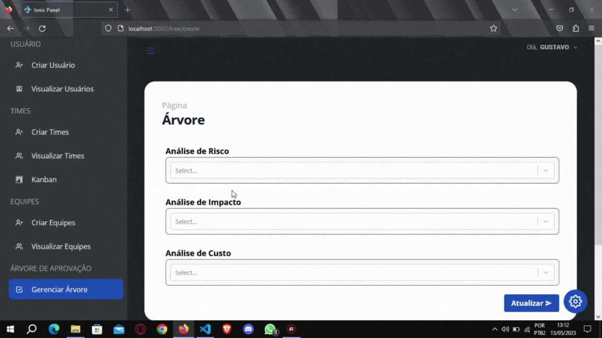
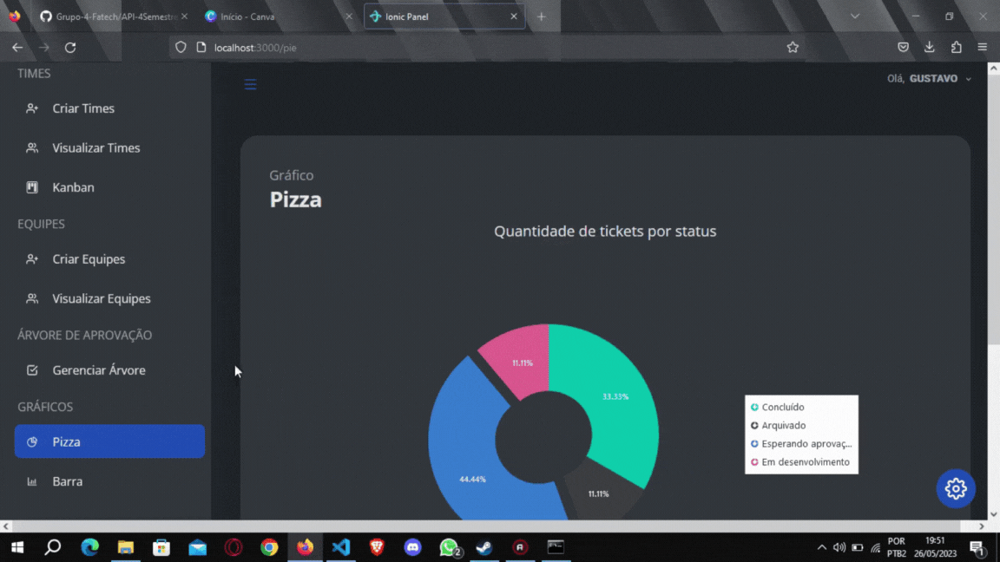

# Quarto Semestre - Fatech
#### Equipe em 1°S 2023

## Parceiro Acadêmico
A Ionic health é uma empresa de tecnologia que transforma a saúde em todo o mundo através de tecnologias de automação. Fornecemos soluções remotas para automatizar, monitorar, acessar, apoiar, educar e teleoperar na área da saúde.

## Visão do Projeto 

O projeto visa desenvolver uma aplicação web responsiva para criação e gerenciamento de tickets e usuários. Os tickets são categorizados como "hotfix" (problemas críticos) e "feature" (solicitações de funcionalidades).

Além disso, a aplicação permite hierarquias de acesso, com diferentes privilégios, e categorização de tickets por tipo, prioridade e departamento. Os usuários podem visualizar, atualizar e atribuir tickets, bem como gerenciar dados de manutenção, como departamentos e tipos de tickets. Esta aplicação fornece uma solução completa para gerenciamento de solicitações de suporte e melhorias organizacionais, com um design moderno e acessível online.

## Demonstração do projeto

##### Para assistir os gif, clique no título abaixo que se interessar.

<b>Cadastro de Ticket</b>

   
    <tr>
     
    </tr>

<b>Atualização do Ticket</b>

   
    <tr>
     
    </tr>

<b>Ticket aprovado ou arquivado </b>

   
    <tr>
     
    </tr>

<b>Kanban</b>

   
    <tr>
     
    </tr>

<b>Arquivado</b>

   
    <tr>
     
    </tr>

<b>Diferença de Acesso</b>

   
    <tr>
     
    </tr>

<b>Alteração de Usuário Logado</b>

   
    <tr>
     
    </tr>

<b>Crud de Equipes</b>

   
    <tr>
     
    </tr>

<b>Crud de Usuários</b>

   
    <tr>
     
    </tr>

<b>Crud de Times e Equipes</b>

   
    <tr>
     
    </tr>

<b>Avaliação dos chamados</b>

   
    <tr>
     
    </tr>

<b>Árvore dinâmica</b>

   
    <tr>
     
    </tr>

<b>Histórico do chamado</b>

   
    <tr>
     
    </tr>

<b>Opção de idioma</b>

   
    <tr>
     
    </tr>

<b>Cadastro de Solução de Chamados</b>

   
    <tr>
     
    </tr>

<b>Notificação por Email
</b>

   
    <tr>
     
    </tr>

<b>Graficos Estatísticos
</b>

   
    <tr>
     
    </tr>

<b>Cadastro de Usuários Interessados
</b>

   
    <tr>
     
    </tr>

## Link para Acessar o Projeto

## Tecnologias Utilizadas

|Tecnologia	|Uso no Projeto|
| :---: | :--- | 
||TypeScript: Utilizado para desenvolvimento do backend e também para a conexão com o banco de dados.|
||JavaScript: Utilizado para desenvolvimento do frontend. |
||React:  Biblioteca JavaScript utilizada para criar interfaces de usuário interativas e estruturadas em componentes  em aplicações web. || 
||CSS: Utilizada para estilização e formatação de páginas da web.|
||PostgreSQL: Sistema de gerenciamento de banco de dados utilizado para armazenamento dados.|
||Git: Ferramenta de controle de versão utilizada para gerenciar o código do projeto.|
||Github: Plataforma utilizada na hospedagem do repositório do projeto.|
||Discord: Plataforma utilizada para comunicar e fazer reuniões pela equipe. |

## Contribuições Pessoais

Neste projeto, minha responsabilidade abrangeu a estruturação do backend, a criação do CRUD para a equipe, o gerenciamento de histórico, criação de uma hierarquia em árvore, construção de um gráfico de barras, tudo desenvolvido em TypeScript. Além da minha contribuição na documentação.

### Hard Skills

|Tecnologia/Metodologia|Classificação|
| :---: | :---: | 
|TypeScript|★★★★☆|
|JavaScript|★★★☆☆|
|React|★★★☆☆|
|CSS|★★★☆☆|
|PostgreSQL|★★★★☆|
|Git / Github|★★★★☆|

### Soft Skills

- Planejamento: Fui responsável por desenvolver um plano de projeto, abrangendo marcos e prazos estrategicamente definidos, assegurando assim a bem-sucedida conclusão dentro do cronograma estipulado.

- Resiliência: Enfrentei desafios e obstáculos persistentes em um projeto crucial, demonstrando perseverança, mantendo o foco e a determinação ao superá-los.

- Trabalho em equipe: Enquanto colaborava em um projeto de significativa complexidade, atuei com eficiência, desempenhando um papel fundamental ao trabalhar harmoniosamente com meus colegas. Estava disposto para ouvir e compartilhar, a fim de alcançarmos nossos objetivos.
