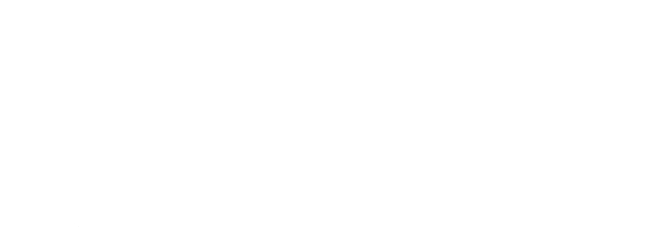
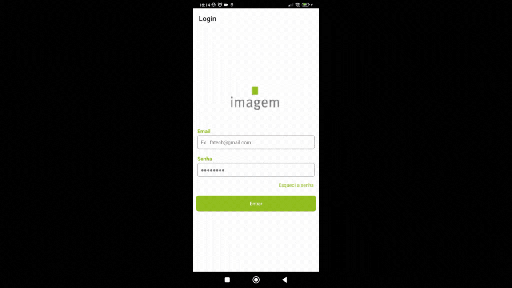
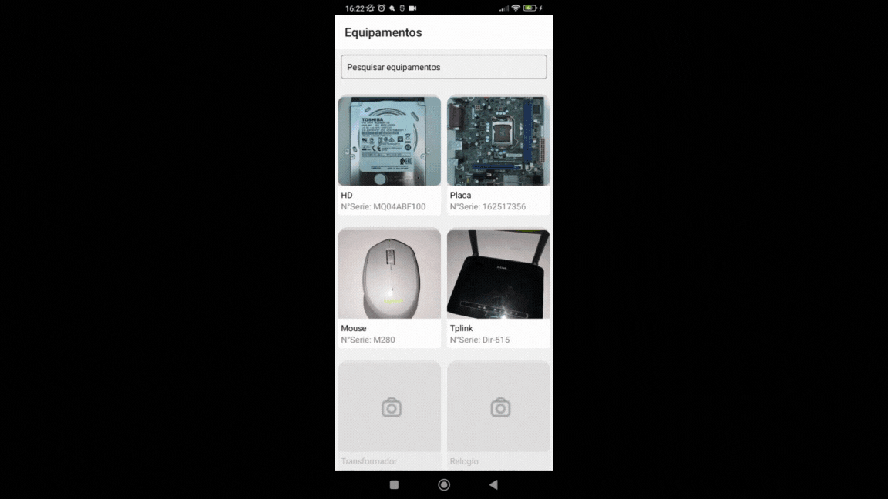
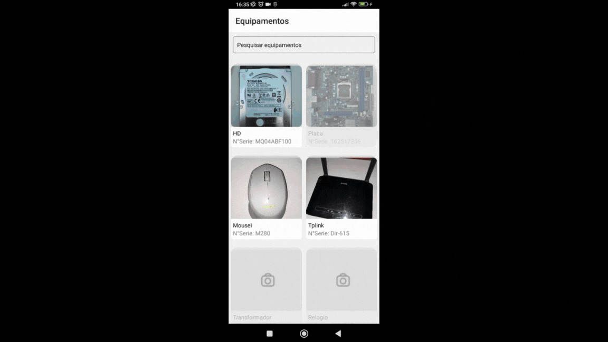
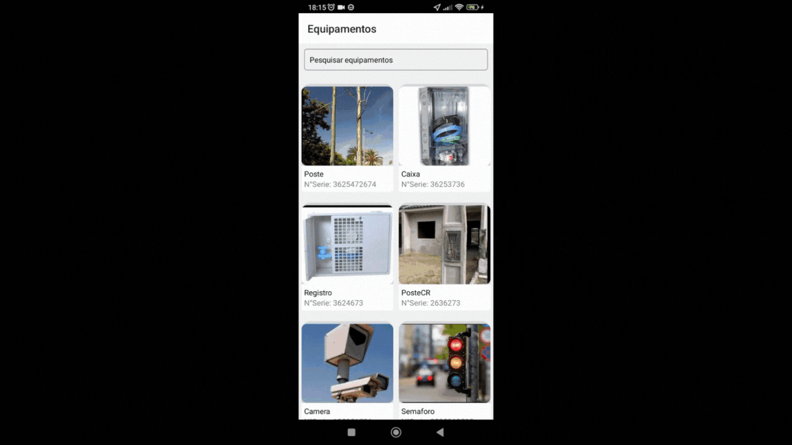
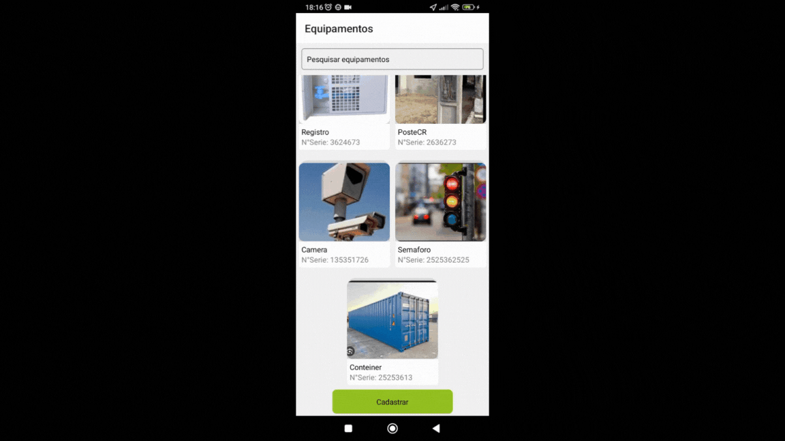
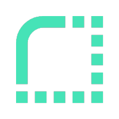

# Quinto Semestre - Fatech
#### Equipe em 2°S 2023

## Parceiro Acadêmico
A Imagem, uma empresa de tecnologia brasileira, destaca-se como líder em Sistemas de Informações Geográficas e é a distribuidora oficial da plataforma ArcGIS, desenvolvida pela Esri nos Estados Unidos.

## Visão do Projeto 
O propósito da aplicação móvel é fornecer uma ferramenta essencial para empresas de engenharia nos setores de Saneamento, Elétrica e Telecomunicações, envolvidas em obras e manutenção em campo. A aplicação permite que os funcionários consultem, atualizem, desativem e cadastrem informações de equipamentos ativos da empresa por meio de um aplicativo acessível em dispositivos móveis.

Essa ferramenta desempenha um papel crucial nos processos de manutenção, garantindo a atualização em tempo real do cadastro de ativos para preservar a qualidade dos serviços prestados aos clientes durante intervenções. A aplicação visa facilitar o gerenciamento eficiente e preciso das informações essenciais dos equipamentos em campo.

## Demonstração do projeto

##### Para assistir os gif, clique no título abaixo que se interessar.

<b>Login</b>

   
    <tr>
     
    </tr>

<b>Editar Equipamento</b>

   
    <tr>
     
    </tr>

<b>Editar Perfil</b>

   
    <tr>
     
    </tr>

<b>Cadastro de Tipo de Usuários </b>

   
    <tr>
     
    </tr>

<b>Diferença de Acesso</b>

   
    <tr>
     
    </tr>

<b>Mapa</b>

   
    <tr>
     
    </tr>

<b>Filtro de Bunca do Mapa</b>

   
    <tr>
     
    </tr>

<b> Localização em Tempo Real </b>

   
    <tr>
     
    </tr>

## Link para Acessar o Projeto

## Tecnologias Utilizadas

|Tecnologia	|Uso no Projeto|
| :---: | :--- | 
||TypeScript: Utilizado para desenvolvimento do backend e também para a conexão com o banco de dados.|
| |Render: Utilizado para a hospedagem do Backend.|
||React:  Biblioteca JavaScript utilizada para criar interfaces de usuário interativas e estruturadas em componentes  em aplicações web. || 
||MongoDB: Sistema de gerenciamento de banco de dados utilizado para  o armazenamento dados.|
||Git: Ferramenta de controle de versão utilizada para gerenciar o código do projeto.|
||Github: Plataforma utilizada na hospedagem do repositório do projeto.|
||Discord: Plataforma utilizada para comunicar e fazer reuniões pela equipe.

## Contribuições Pessoais

### Hard Skills

|Tecnologia/Metodologia|Classificação|
| :---: | :---: | 
|TypeScript|★★★★☆|
|Render|★★★★★|
|React|★★★☆☆|
|MongoDB|★★★★★|
|Git / Github|★★★★☆|

### Soft Skills

