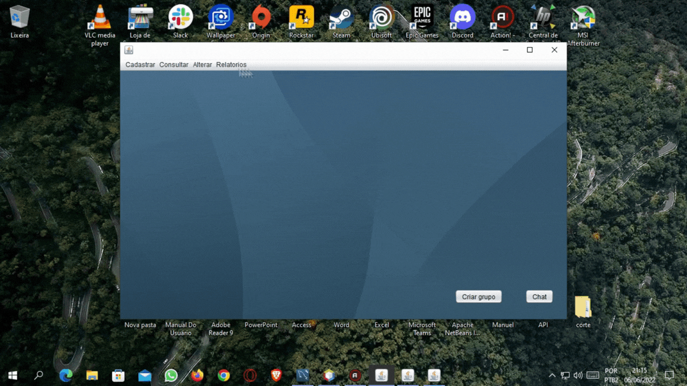

# Segundo Semestre - Fatech
#### Equipe em 1°S 2022

## Parceiro Acadêmico

A Pro4Tech se destaca Digital Transformation, fazendo uso de tecnologias como inteligência artificial, análise de dados, IoT e nuvem.Utilizando métodos ágeis, como Squads e Scrum, garantem entregas de alta qualidade e mantêm comunicação transparente para estabelecer parcerias duradouras. Seu propósito é impulsionar o crescimento e a eficiência operacional por meio da digitalização.

## Visão do Projeto 

Desenvolvimento de uma aplicação de desktop com o objetivo de resolver desafios decorrentes da fragmentação de mensagens em diferentes canais.

O foco principal reside na unificação de todas as mensagens em um único banco de dados. Para apresentação das informações, será implementado um menu de controle, abrangendo as seguintes funcionalidades: cadastro, edição, exclusão e visualização de dados relacionados a mensagens, usuários e grupos. 

## Demonstração do projeto

##### Para assistir os gif, clique no título abaixo que se interessar.

<b>Login </b>

   
    <tr>
     
    </tr>

<b>Cadastro </b>

   
    <tr>
     
    </tr>

<b>Alteração </b>

   
    <tr>
     
    </tr>

<b>Consulta </b>

   
    <tr>
     
    </tr>

<b>Relatórios </b>

   
    <tr>
     
    </tr>

<b>Chat e Grupos </b>

   
    <tr>
     
    </tr>

## Link para Acessar o Projeto

## Tecnologias Utilizadas

|Tecnologia	|Uso no Projeto|
| :---: | :--- | 
||Java: Linguagem de programação utilizada no desenvolvimento do aplicativo desktop.|
|| NetBeans: IDE (Integrated Development Environment) utilizada para o desenvolvimento e programação do projeto. |
||MySQL: Sistema de gerenciamento de banco de dados utilizado para armazenamento dados.|
||Microsoft Azure: Utilizado para  hospedagem do  bancos de dados na nuvem.|
||Git: Ferramenta de controle de versão utilizada para gerenciar o código do projeto.|
||Github: Plataforma utilizada na hospedagem do repositório do projeto.|
||Discord: Plataforma utilizada para comunicar e fazer reuniões pela equipe. |

## Contribuições Pessoais

Neste projeto, assumi a responsabilidade de elaborar e planejar o escopo do projeto, além de encarregar das funções de alteração do Usuário e do Grupo, bem como a consulta de Usuários utilizando a IDE NetBeans.Também contribuí ativamente para a documentação do projeto.

### Hard Skills

|Tecnologia/Metodologia|Classificação|
| :---: | :---: | 
|Java|★★★☆☆|
|NetBeans|★★★☆☆|
|Mysql|★★★★☆|
|Azure|★★★★☆|
|Git / Github|★★★★☆|

### Soft Skills

- Gestão de Tempo: Nas reuniões, estabelecemos prazos e metas para cada tarefa, garantindo assim um desenvolvimento eficaz.

- Adaptabilidade:  Com o decorrer desse projeto tive a infelicidade de ficar sem um computador pessoal, realizando minha contribuição na biblioteca da faculdade, assegurando assim a entrega da minha parte no projeto.

