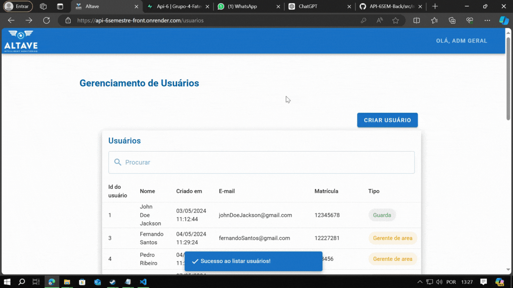

# Sexto Semestre - Fatech

#### Equipe em 1°S 2024

## Parceiro Acadêmico

A Altave é uma empresa brasileira, reconhecida como única desenvolvedora e fabricante de soluções de monitoramento inteligente baseadas em aeróstatos para diversos setores, como Defesa e Segurança, Energia, Mineração, Portos, Agronegócio e Petróleo e Gás.

## Visão do Projeto

Desenvolver um sistema automático para contabilizar a entrada e saída de pessoas em cada redzone, utilizando uma câmera posicionada no ponto de entrada. Esse sistema deve oferecer uma interface intuitiva que permita o cadastro, visualização, atualização e desativação de dados relacionados aos departamentos, redzones e usuários. Além disso, é necessário possibilitar o download de relatórios para períodos específicos, tanto a nível de departamentos quanto de redzones.

## Demonstração do projeto

##### Para assistir os gifs, clique no título abaixo que se interessar.

  
<b>Contagem Automática de Pessoas</b>

     
      <tr>
      
      </tr>

  
<b>Login e Níveis de Usuários</b>

     
      <tr>
      
      </tr>

  
<b>Tela de Perfil do Usuário</b>

     
      <tr>
      
      </tr>

  
<b>Crud de Redzone</b>

     
      <tr>
      
      </tr>

  
<b>Crud de Departamento</b>

     
      <tr>
      
      </tr>

  
<b>Crud de Usuário</b>

     
      <tr>
      
      </tr>

  
<b>Relatório por Redzone</b>

     
      <tr>
      
      </tr>

  
<b>Relatório por Departamento</b>

     
      <tr>
      
      </tr>

  
<b>Recuperação de senha</b>

     
      <tr>
      
      </tr>

## Link para Acessar o Projeto

  

## Tecnologias Utilizadas

|                           Tecnologia                            | Uso no Projeto                                                                                                                                                                    |
| :-------------------------------------------------------------: | :-------------------------------------------------------------------------------------------------------------------------------------------------------------------------------- |
|      | Java: Linguagem de programação de alto nível, orientada a objetos, utilizada para o desenvolvimento do Backend, proporcionado robustez e segurança.                               |
|    | Spring Boot: Framework em Java utilizado para o desenvolvimento do Backend, proporcionando uma configuração simplificada.|
|                          | YOLOv8: Utilizado para treinamento de IA permitindo o reconhecimento eficiente e uma análise de dados em tempo real.                                                              |
|    | Python: Linguagem usada para manipulação da IA, reconhecida por sua versatilidade e ampla variedade de bibliotecas especializadas em aprendizado de máquina.                      |
|       | Vue: Usado no nosso Frontend para a criação de uma interface para os usuários dinâmica e responsiva.|
|  | Supabase: Utilizado como banco de dados do projeto, oferecendo gerenciamento de dados relacional e atualização em tempo real. |
|       | Git: Ferramenta de controle de versão empregada para gerenciar o código do projeto.                                                                                               |
|    | GitHub: Plataforma utilizada para hospedar o repositório do projeto, facilitando o compartilhamento e colaboração entre os membros da equipe.                                     |
|                        | Render: Plataforma utilizada para a hospedagem do nosso projeto.                                                                                                                  |
|     | Azure DevOps: Plataforma usada para o gerenciamento da equipe, facilitando a visualização e coordenação das entregas do projeto.                                                  |
|    | Visual Studio Code: IDE escolhida e amplamente utilizada pela equipe durante o projeto, devido à sua interface amigável e suporte extensivo a diversas linguagens de programação. |
|                         | Slack: Ferramenta utilizada para a comunicação com o parceiro acadêmico, fundamental para manter o alinhamento do projeto.                                                        |
|   | Discord: Plataforma utilizada para comunicação da equipe, permitindo a realização de reuniões e colaboração durante o desenvolvimento do projeto.                                 |

## Contribuições Pessoais
Nesse projeto, assumi o papel de Product Owner (PO), sendo responsável pela interação com o cliente. Minha missão foi formular perguntas estratégicas para extrair o máximo de informações possível, a fim de produzir um backlog priorizado de qualidade, contendo user stories, critérios de aceitação e seus cenários, devidamente divididos em tasks.  Além disso, fui responsável pela criação do nosso modelo de banco de dados.

### Hard Skills

| Tecnologia/Metodologia | Classificação |
| :--------------------: | :-----------: |
|Spring Boot|★★★☆☆|
|Python|★★★☆☆|
|Vue|★★★☆☆|
|Supabase|★★★★☆|
|Git / Github|★★★★☆|
|Render|★★★★★|
|Azure DevOps|★★★★★|

### Soft Skills

- Comunicação: Mantive uma comunicação constante e clara com o cliente e a equipe, explicando as user stories, critérios de aceitação e cenários. Anotei todas as sugestões e decisões, garantindo que todos os envolvidos tivessem uma compreensão completa dos objetivos e do progresso do projeto.

- Organização: Estruturei o backlog de forma organizada e eficiente, dividindo as user stories em tasks claras e gerenciáveis. Também criei um modelo de banco de dados bem estruturado, garantindo que todos os elementos estivessem presentes.

- Resolução de Problemas: Enfrentei e resolvi problemas ao longo do projeto, ajustando a prioridade de tarefas conforme necessário para superar desafios e manter o progresso no caminho certo.
