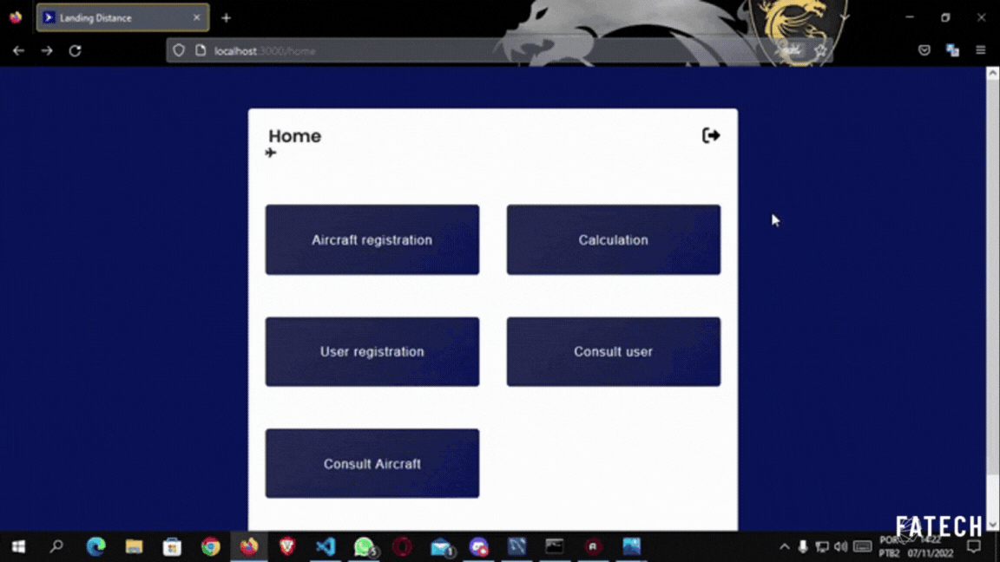

# Terceiro Semestre - Fatech
#### Equipe em 2°S 2022

## Parceiro Acadêmico

A Embraer é uma empresa brasileira de destaque na indústria da aviação, especializada na fabricação de aeronaves, como jatos comerciais, executivos e militares. Além disso, a empresa se destaca na produção de sistemas de defesa e segurança, contribuindo significativamente para a tecnologia aeroespacial global.

## Visão do Projeto 

O propósito deste projeto é otimizar o cálculo da distância necessária para aterrissagem de aeronaves, com o objetivo de simplificar o processo para os pilotos. Para alcançar essa melhoria, desenvolvemos uma aplicação web que integra uma tabela abrangente, considerando as características da aeronave, as condições da pista e outros fatores relevantes. Essa ferramenta visa facilitar e agilizar as decisões dos pilotos durante as operações de pouso.

## Demonstração do projeto

<b>Login Cliente</b>

   
    <tr>
     
    </tr>

<b>Login Administrador</b>

   
    <tr>
     
    </tr>

<b>Cadastro de usuário </b>

   
    <tr>
     
    </tr>

<b>Consulta usuários </b>

   
    <tr>
     
    </tr>

<b>Cadastro de aeronave  </b>

   
    <tr>
     
    </tr>

<b>Consulta aeronave </b>

   
    <tr>
     
    </tr>

<b>Cálculo de pouso</b>

   
    <tr>
     
    </tr>

<b>Conversão de unidade de medida</b>

   
    <tr>
     
    </tr>

## Link para Acessar o Projeto

## Tecnologias Utilizadas

|Tecnologia	|Uso no Projeto|
| :---: | :--- | 
||TypeScript: Utilizado para desenvolvimento do backend e também para a conexão com o banco de dados.|
||JavaScript: Utilizado para desenvolvimento do frontend. |
||React:  Biblioteca JavaScript utilizada para criar interfaces de usuário interativas e estruturadas em componentes  em aplicações web. || 
||CSS: Utilizada para estilização e formatação de páginas da web.|
||MySQL: Sistema de gerenciamento de banco de dados utilizado para armazenamento dados.|
||Git: Ferramenta de controle de versão utilizada para gerenciar o código do projeto.|
||Github: Plataforma utilizada na hospedagem do repositório do projeto.|
||Discord: Plataforma utilizada para comunicar e fazer reuniões pela equipe. |

## Contribuições Pessoais

Neste projeto, assumi a responsabilidade pela administração o banco de dados MySQL e a conexão com o projeto foi realizada por meio do uso do Sequelize. Além disso, fiquei encarregado dos CRUDs relacionados a aeronaves e as tabelas, todas elas desenvolvidas em TypeScript."

### Hard Skills

|Tecnologia/Metodologia|Classificação|
| :---: | :---: | 
|TypeScript|★★★★☆|
|JavaScript|★★★☆☆|
|React|★★★☆☆|
|CSS|★★★☆☆|
|Mysql|★★★★☆|
|Git / Github|★★★★☆|

### Soft Skills

- Trabalho em equipe: Enquanto colaborava em um projeto de significativa complexidade, atuei com eficiência, desempenhando um papel fundamental ao trabalhar harmoniosamente com meus colegas. Estava disposto para ouvir e compartilhar, a fim de alcançarmos nossos objetivos.

- Comunicação: Utilizamos o chat do Discord para notificações relacionadas ao projeto, com o propósito de manter o foco principal.

 - Gestão de tempo: Durante nossas reuniões, estabelecemos prazos e metas claras para cada tarefa, garantindo, desse modo, um desenvolvimento eficaz e alinhado com os propósitos do projeto.
